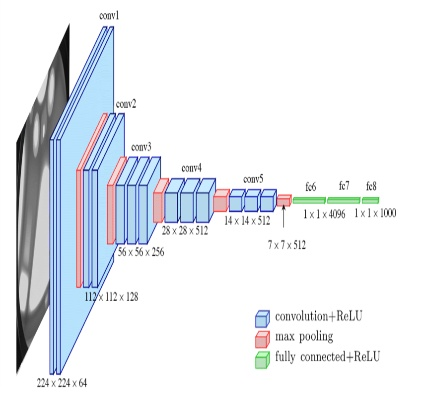
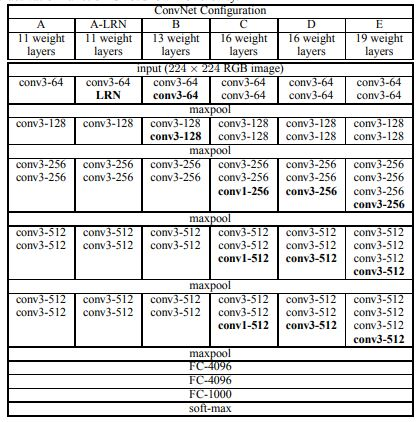

# Pytorch implementation of VGG architecturs
In this project, the VGG architecture is implemented according to the scientific article [Very Deep Convolutional Networks for Large-Scale Image Recognition](https://arxiv.org/abs/1409.1556)



## Run
python ```main.py [type of VGG architecture]```
* types of VGG architecture: [vgg13, vgg16, vgg19]


